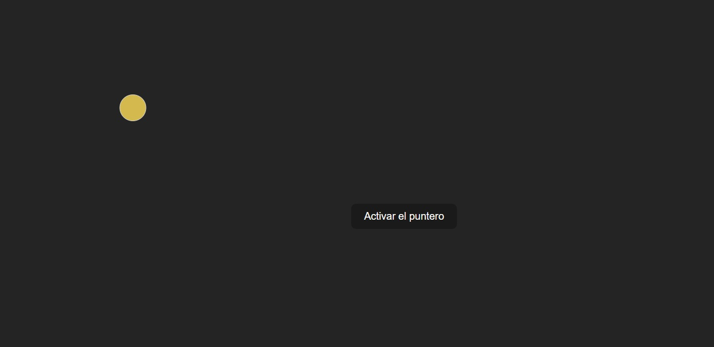

**react.js** • **vite** 

## Mouse Follower

Este proyecto es una implementación de un *mouse follower* utilizando React y el hook `useEffect`. El *mouse follower* sigue la posición del cursor en la pantalla en tiempo real, creando un efecto visual interactivo. Mediante `useEffect`, se registran y limpian los eventos de movimiento del ratón para actualizar las coordenadas del cursor en el estado del componente, lo que permite que el seguidor se mueva de manera fluida y eficiente.

